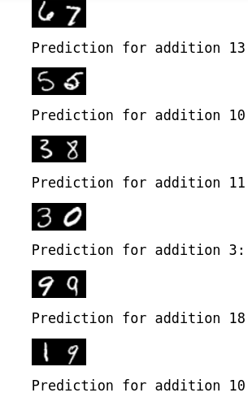
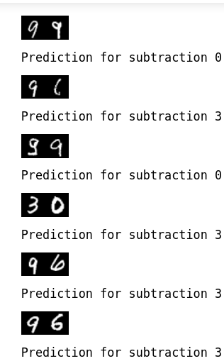
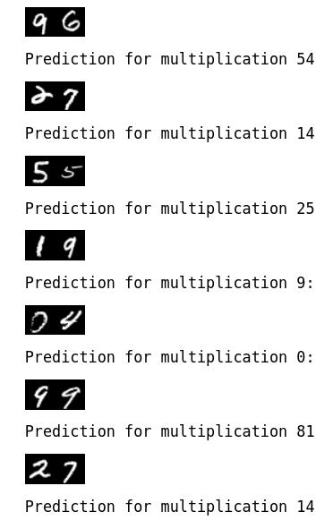

# MNIST_arithmetic_operations-(Add-subtract-multiply)

The code Performing Arithmetic Using a Neural Network Trained on Images of Digit Permutation combinations.
the goal is to teach a network model to perform arithmetic operations and make predictions for operation selected.

## Note:
The network does not make predictions and then perform aritmetic operations based on after predcited value. Instead it learns how to perform the operation in the network.

```1] The file SumMNIST consists of only addition```
```2] The file DiffSuMNIST consists of all the aritmetic opeartions choosen by the user.```
```3] The file 10 fold cross validation trains the network for better accuracy with large number of samples.(The training might take a bit longer than usual)```

# Here are some of the results obtained from the model
## 1. Addition



## 2. Subtraction



## 3. Multiplication




# Paper
This repository contains code for the work described in the following paper and also extention work based on this paper:

Bloice, M.D., Roth, P.M., and Holzinger, A. Performing arithmetic using a neural network trained on images of digit permutation pairs. Journal of Intelligent Information Systems (2021). https://doi.org/10.1007/s10844-021-00662-9
